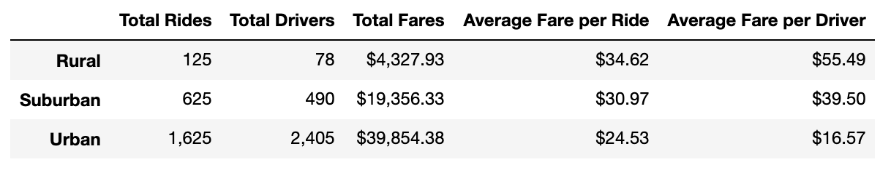

# **PyBer Analysis**

## **1. Overview of the PyBer Analysis**

As the new Data Analyst at PyBer, a ride-sharing app company, I have been tasked with performing an exploratory analysis and creating supporting visualizations on the relationship between the type of city and various factors such as the number of riders, drivers and average fares.

This project will focus on developing a summary of ride-sharing data by city type and total weekly fares for each city type.  The findings in this analysis will hopefully help PyBer improve access to our services for underserved neighborhoods.

I worked with the following **resources** to generate the results:
- **Data Sources**: [city data](Resources/city_data.csv) and [ride data](Resources/ride_data.csv)
- **Software**: Python 3.7.6, Jupyter Notebook
- **Dependencies**: Pandas and Matplotlib imported as below

    ```python
    import matplotlib.pyplot as plt
    import pandas as pd
    ```
- **ipynb Results File**: [PyBer Challenge](PyBer_Challenge.ipynb)

## **2. PyBer Analysis Results**
- Summary of ride-sharing data by city type:

    

    - The above summary DataFrame shows that PyBer is used more frequently in urban cities than compared to suburban or rural areas as shown by the number of total rides, total drivers and total fares. 

    - However, when it comes to the average fare per ride, rural areas are $10 and $4 more than urban and suburban areas respectively.  

    - Similary, when it comes to the average fare per driver, rural areas are $39 and $16 more than urban and suburban areas respectively.

- Multiple-line chart visualizing the total fare by city type on a weekly basis from 01/01/2019 to 04/29/2019 time period:

    

    - The above line chart shows that during a period of 4 months, urban cities consistently earned higher total fares on a weekly basis than suburban and rural areas, with rural neighborhoods earning the lowest amounts throughout the period.

## **3. PyBer Analysis Summary**

Based on these results, there are three business recommendations I am making to the CEO of PyBer to address the disparaties among the city types.

1. Flat rate per ride:
    - Urban areas are lucrative for PyBer as ride-shares are most economical when distance of the ride is shorter, have higher ridership and more drivers are working to meet demand.  This model works for urban areas as these cities tend to be more dense, have more customers who do not own cars and have more drivers to meet demand.  
    - We should approach rural areas differently.  Many people own their own vehicles in rural areas and most likely need to travel longer distances.  Currently at the average fare per ride of $34.62, it seems more economical for potential customers to drive their own cars and pay for gas than to use our service.  
    - If we incorporate a flat rate per ride, this could encourage ridership.

2. Growth opportunity in rural areas:
    - There is a huge growth opportunity in rural areas.  Currently, this is a developing market as our PyBer app relies on good cell service which can be spotty in rural areas.  
    - As access to cell service continues to improve in rural communities, I believe that it will correlate with increased usage of our service.
    - Additionally, earnings for our drivers are the highest in rural areas making PyBer an attractive source of income for people in these neighborhoods.  
    
3. Alternate option to driving your own car:
    - Unlike urban areas where we are competing for customers with local city cabs, suburban and rural areas typically lack these hail-ride cab services so there really is no alternative to driving your own car.  
    - If we can continue to attract more drivers, especially in the suburban areas, we can meet the continuing increase in demand.  Drivers in these areas earn good average fares per driver ($39.50) so we should look to target recruitment efforts in suburban neighborhoods.
